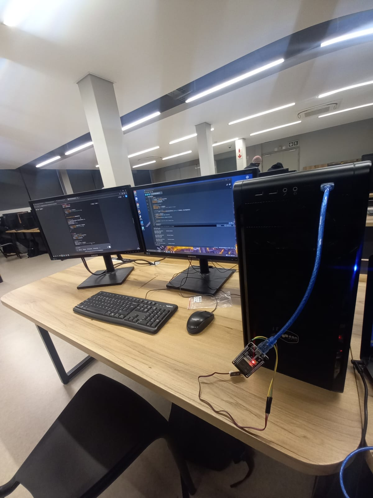

# Arduino_ESP32

## Project Overview

This repository contains several ESP32 Arduino sketches related to sensor data collection and communication using ESP-NOW:

- **LED_OnOff.ino**  
  Controls turning an LED on and off.

- **TemperatureSensor_v1.0.ino**  
  Reads temperature sensor data and outputs it.

- **analoglightsensor_V2.1.ino**  
  Reads data from an analog light sensor.

- **espnow_receiver.ino**  
  ESP32 receiver sketch that collects sensor data sent via ESP-NOW and hosts a web dashboard.

- **espnow_sender.ino**  
  ESP32 sender sketch that transmits sensor data over ESP-NOW.

- **macAddress_ESP32.ino**  
  Utility sketch to retrieve the MAC address of ESP32 boards for network identification.

---

You can flash each sketch to the respective ESP32 device depending on its role in the system.
